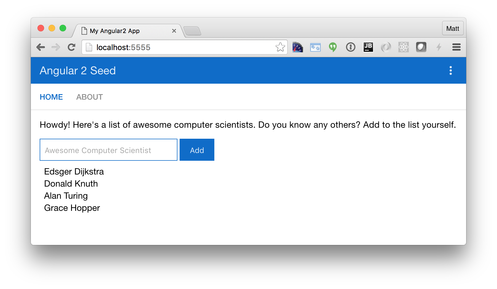
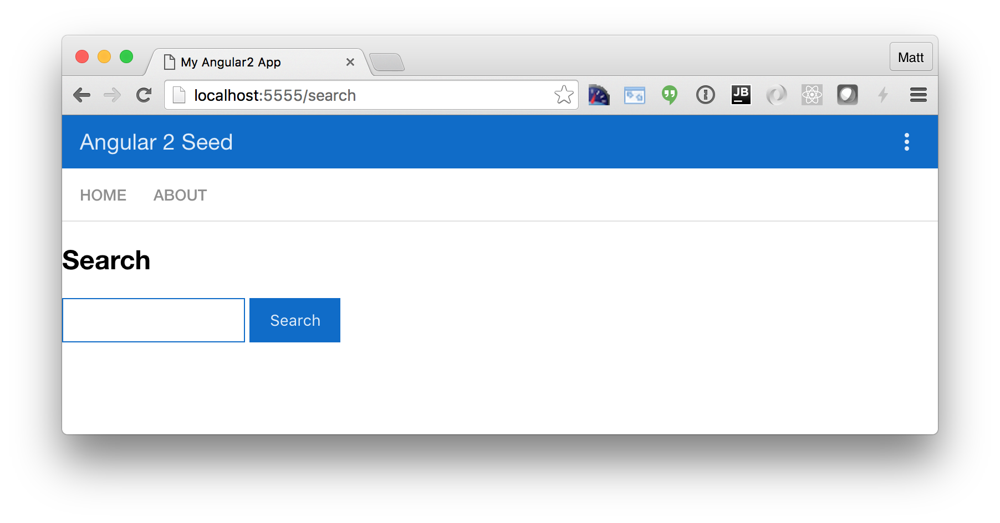
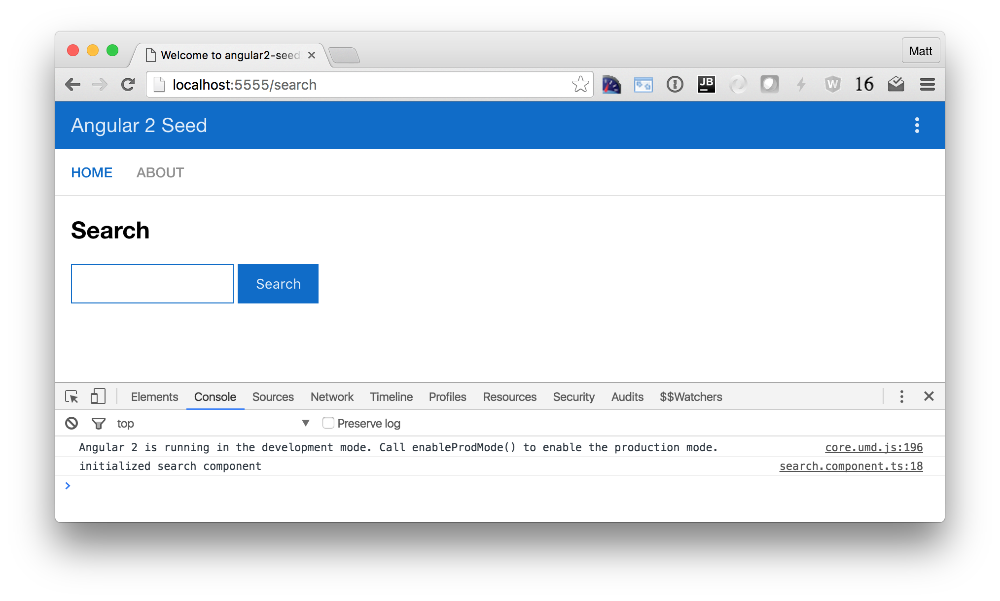
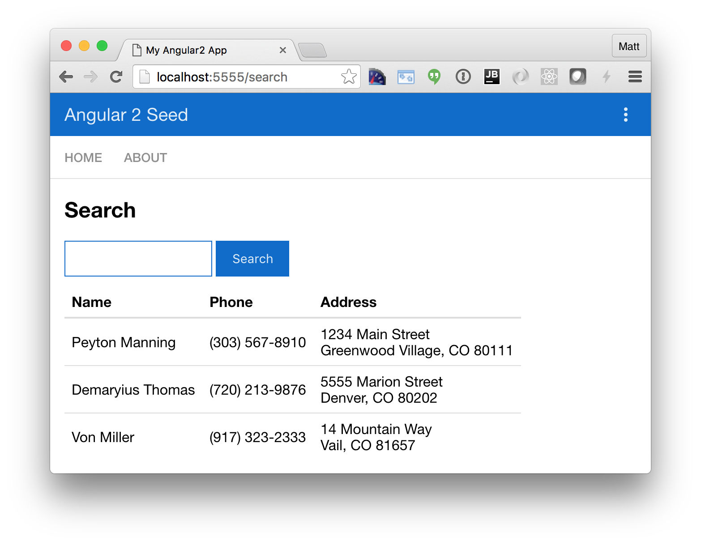
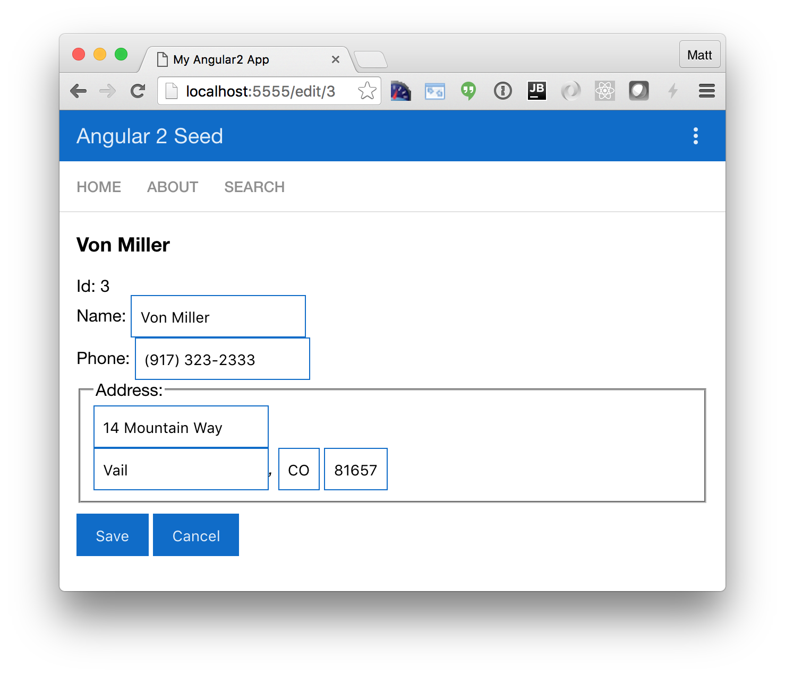

= Getting Started with Angular 2

:author: Matt Raible
:email:  matt@raibledesigns.com
:revnumber: 1.1
:revdate:   {docdate}
:subject: Angular 2
:keywords: Angular 2, JavaScript, TypeScript, npm, gulp, RxJS
:doctype: book
:toc: macro
:icons: font
:lang: en
:language: javadocript
:sourcedir: .

This is an application I built to help myself learn Angular 2. I tried to keep the functionality and features similar
to http://raibledesigns.com/rd/entry/getting_started_with_angularjs[Getting Started with AngularJS] and
http://raibledesigns.com/rd/entry/testing_angularjs_applications[Testing AngularJS Applications] so you can
compare https://github.com/mraible/angular-tutorial[the code] between the two.

toc::[]

== What you'll build

You'll build a simple web application with Angular 2 and TypeScript. You'll add search and edit features with mock data.

== What you'll need

* About 15-30 minutes.
* A favorite text editor or IDE. I recommend https://www.jetbrains.com/idea/[IntelliJ IDEA].
* http://git-scm.com/[Git] installed.
* http://nodejs.org/[Node.js] and npm installed. I recommend using https://github.com/creationix/nvm[nvm].

== Create your project

Clone the https://github.com/mgechev/angular2-seed[angular2-seed] repository using git:

----
git clone https://github.com/mgechev/angular2-seed.git angular2-tutorial
cd angular2-tutorial
----

[NOTE]
====
The seed project requires node v4.x.x or higher and npm 2.14.7. I used node v4.2.6 and npm 3.9.3.
====

Install the project's dependencies:

----
npm install
----

== Run the application

The project is configured with a simple web server for development. To start it, run:

----
npm start
----

You should see a screen like the one below at http://localhost:5555.

[[default-homepage]]
.Default homepage

You can see your new project's test coverage by running `npm test`:

[source]
----
=============================== Coverage summary ===============================
Statements   : 96.36% ( 159/165 )
Branches     : 62.5% ( 120/192 )
Functions    : 100% ( 35/35 )
Lines        : 100% ( 129/129 )
================================================================================
----

== Add a search feature

To add a search feature, open the project in an IDE or your favorite text editor. For IntelliJ IDEA, use
File > New Project > Static Web and point to the directory you cloned angular2-seed to.

=== The Basics

Create a `src/client/app/+search` folder and a `search.component.html` file in it. The + prefix is an indicator
to Angular that you want to lazy-load the components in this directory. Populate the HTML file you created with
the following:

[source,xml]
.src/client/app/+search/search.component.html
----
<h2>Search</h2>
<form>
  <input type="search" [(ngModel)]="query" (keyup.enter)="search()">
  <button type="button" (click)="search()">Search</button>
</form>

loading...

<pre>{{searchResults | json}}</pre>
----

Create `src/client/app/+search/search.component.ts` to define the `SearchComponent` and point to this template.

[source,js]
.src/client/app/+search/search.component.ts
----
import { Component } from '@angular/core';
import { CORE_DIRECTIVES, FORM_DIRECTIVES } from '@angular/common';
import { ROUTER_DIRECTIVES } from '@angular/router';

@Component({
  selector: 'sd-search',
  moduleId: module.id,
  templateUrl: 'search.component.html',
  directives: [FORM_DIRECTIVES, CORE_DIRECTIVES, ROUTER_DIRECTIVES]
})
export class SearchComponent {
  loading: boolean;
  query: string;
  searchResults: any;

  constructor() {
    console.log('initialized search component');
  }
}
----

Create `src/client/app/+search/index.ts` to export `SearchComponent`.

[source,javascript]
----
/**
 * This barrel file provides the export for the lazy loaded SearchComponent.
 */
export * from './search.component';
----

Update `src/client/app/app.component.ts` to import this component and include its route.

[source,javascript]
.src/client/app/app.component.ts
----
import { SearchComponent } from './+search/index';

@Routes([
  { path: '/', component: HomeComponent },
  { path: '/about', component: AboutComponent },
  { path: '/search', component: SearchComponent }
])
----

Your browser should refresh automatically, thanks to http://browsersync.io[Browsersync]. Navigate to
http://localhost:5555/search and you should see the search component.

[[search-component]]
.Search component

You can see it needs a bit of styling. Angular 2 allows you to provide styles specific for your component using a `styleUrls` property on your component.
Add this property as you see below.

[source,javascript]
.src/client/app/+search/search.component.ts
----
templateUrl: 'search.component.html',
styleUrls: ['search.component.css'],
directives: [FORM_DIRECTIVES, CORE_DIRECTIVES, ROUTER_DIRECTIVES]
----

Create `src/client/app/+search/search.component.css` and add some CSS.

[source,css]
.src/client/app/+search/search.component.css
----
:host {
  display: block;
  padding: 0 16px;
}
----

There, that looks better!

.Search component with styling

Finally, update `src/client/app/shared/navbar/navbar.component.html` to include a link to the search route.

[source,xml]
.src/client/app/shared/navbar/navbar.component.html
----
<nav>
  <a [routerLink]="['/']">HOME</a>
  <a [routerLink]="['/about']">ABOUT</a>
  <a [routerLink]="['/search']">SEARCH</a>
</nav>
----

This section has shown you how to add a new component to a basic Angular 2 application.
The next section shows you how to create a use a JSON file and `localStorage` to create a fake API.

=== The Backend

To get search results, create a `SearchService` that makes HTTP requests to a JSON file. Start
by creating `people.json` to hold your data.

[source,json]
.src/client/app/shared/search/data/people.json
----
[
  {
    "id": 1,
    "name": "Peyton Manning",
    "phone": "(303) 567-8910",
    "address": {
      "street": "1234 Main Street",
      "city": "Greenwood Village",
      "state": "CO",
      "zip": "80111"
    }
  },
  {
    "id": 2,
    "name": "Demaryius Thomas",
    "phone": "(720) 213-9876",
    "address": {
      "street": "5555 Marion Street",
      "city": "Denver",
      "state": "CO",
      "zip": "80202"
    }
  },
  {
    "id": 3,
    "name": "Von Miller",
    "phone": "(917) 323-2333",
    "address": {
      "street": "14 Mountain Way",
      "city": "Vail",
      "state": "CO",
      "zip": "81657"
    }
  }
]
----

Create `src/client/app/shared/search/search.service.ts` and provide `Http` as a dependency in its constructor.
In this same file, define the `Address` and `Person` classes that JSON will be marshalled to.

[source,javascript]
.src/client/app/shared/search/search.service.ts
----
import { Injectable } from '@angular/core';
import { Http, Response } from '@angular/http';

@Injectable()
export class SearchService {
  constructor(private http:Http) {}

  getAll() {
    return this.http.get('app/shared/search/data/people.json').map((res:Response) => res.json());
  }
}

export class Address {
  street:string;
  city:string;
  state:string;
  zip:string;

  constructor(obj?:any) {
    this.street = obj && obj.street || null;
    this.city = obj && obj.city || null;
    this.state = obj && obj.state || null;
    this.zip = obj && obj.zip || null;
  }
}

export class Person {
  id:number;
  name:string;
  phone:string;
  address:Address;

  constructor(obj?:any) {
    this.id = obj && Number(obj.id) || null;
    this.name = obj && obj.name || null;
    this.phone = obj && obj.phone || null;
    this.address = obj && obj.address || null;
  }
}
----

In `search.component.ts`, add imports for these classes.

[source,javascript]
.src/client/app/+search/search.component.ts
----
import { Person, SearchService } from '../shared/index';
----

You can now add a type to the `searchResults` variable. While you're there, modify the constructor to inject the `SearchService`.

[source,javascript]
.src/client/app/+search/search.component.ts
----
searchResults: Array<Person>;

constructor(public searchService: SearchService) {}
----

Then implement the `search()` method to call the service's `getAll()` method.

[source,javascript]
.src/client/app/+search/search.component.ts
----
search(): void {
  this.searchService.getAll().subscribe(
    data => {this.searchResults = data;},
    error => console.log(error)
  );
}
----

At this point, you'll likely see the following message in your browser's console.

----
ORIGINAL EXCEPTION: No provider for SearchService!
----

This happens because the app hasn't provided this service to components. To fix this, create
`src/client/app/shared/search/index.ts` and populate it with the following:

[source,javascript]
.src/client/app/shared/search/index.ts
----
/**
 * This barrel file provides the export for the shared SearchService.
 */
export * from './search.service';
----

Then add a reference to this file in `src/client/app/shared/index.ts` so its included in the
shared export.

[source,javascript]
.src/client/app/shared/index.ts
----
/**
 * This barrel file provides the exports for the shared resources (services, components).
 */
export * from './name-list/index';
export * from './navbar/index';
export * from './toolbar/index';
export * from './search/index';
----

To fix the "No provider" error from above, update `app.component.ts` to import the `SearchService`
and add the service to the list of providers.

[source,javascript]
.src/client/app/app.component.ts
----
import { NameListService, NavbarComponent, ToolbarComponent, SearchService } from './shared/index';

@Component({
  selector: 'sd-app',
  viewProviders: [NameListService, SearchService, HTTP_PROVIDERS]
  moduleId: module.id,
----

Now clicking the search button should work. To make the results look better,
remove the `<pre>` tag and replace it with a `<table>`.

[source,xml]
.src/client/app/+search/search.component.html
----
<table *ngIf="searchResults">
  <thead>
  <tr>
    <th>Name</th>
    <th>Phone</th>
    <th>Address</th>
  </tr>
  </thead>
  <tbody>
  <tr *ngFor="let person of searchResults; let i=index">
    <td>{{person.name}}</td>
    <td>{{person.phone}}</td>
    <td>{{person.address.street}} 
      {{person.address.city}}, {{person.address.state}} {{person.address.zip}}
    </td>
  </tr>
  </tbody>
</table>
----

Then add some additional CSS for this component.

[source,css]
.src/client/app/+search/search.component.css
----
table {
  margin-top: 10px;
  border-collapse: collapse;
}

th {
  text-align: left;
  border-bottom: 2px solid #ddd;
  padding: 8px;
}

td {
  border-top: 1px solid #ddd;
  padding: 8px;
}
----

Now the search results look better.

[[search-results]]
.Search results

But wait, we still don't have search functionality! To add a search feature, add a `search()` method to `SearchService`.

[source,javascript]
.src/client/app/shared/search/search.service.ts
----
search(q:string) {
  if (!q || q === '*') {
    q = '';
  } else {
    q = q.toLowerCase();
  }
  return this.getAll().map(data => {
    let results:any = [];
    data.map(item => {
      if (JSON.stringify(item).toLowerCase().includes(q)) {
        results.push(item);
      }
    });
    return results;
  });
}
----

Then refactor `SearchComponent` to call this method with its `query` variable.

[source,javascript]
.src/client/app/+search/search.component.ts
----
search(): void {
  this.searchService.search(this.query).subscribe(
    data => {this.searchResults = data;},
    error => console.log(error)
  );
}
----

Now search results will be filtered by the query value you type in.

This section showed you how to fetch and display search results. The next section builds on this and shows how to edit and save a record.

== Add an edit feature

Modify `search.component.html` to add a link for editing a person.

[source,html]
.src/client/app/+search/search.component.html
----
<td><a [routerLink]="['/edit', person.id]">{{person.name}}</a></td>
----

Create `src/client/app/+edit/edit.component.html` to display an editable form. You might notice I've added `id` attributes to most elements. This is to
make things easier when writing integration tests with Protractor.

[source,html]
.src/client/app/+edit/edit.component.html
----

  <h3>{{editName}}</h3>
  

    <label>Id:</label>
    {{person.id}}
  

  

    <label>Name:</label>
    <input [(ngModel)]="editName" id="name" placeholder="name"/>
  

  

    <label>Phone:</label>
    <input [(ngModel)]="editPhone" id="phone" placeholder="Phone"/>
  

  <fieldset>
    <legend>Address:</legend>
    <address>
      <input [(ngModel)]="editAddress.street" id="street"> 
      <input [(ngModel)]="editAddress.city" id="city">,
      <input [(ngModel)]="editAddress.state" id="state" size="2">
      <input [(ngModel)]="editAddress.zip" id="zip" size="5">
    </address>
  </fieldset>
  <button (click)="save()" id="save">Save</button>
  <button (click)="cancel()" id="cancel">Cancel</button>

----

Create an `EditComponent` that references this template and handles communication with the `SearchService`.

[source,javascript]
.src/client/app/+edit/edit.component.ts
----
import { Component, OnInit } from '@angular/core';
import { Person, Address, SearchService } from '../shared/index';
import { RouteSegment, Router } from '@angular/router';

@Component({
  selector: 'sd-edit',
  moduleId: module.id,
  templateUrl: 'edit.component.html',
  styleUrls: ['edit.component.css']
})
export class EditComponent implements OnInit {

  person: Person;
  editName: string;
  editPhone: string;
  editAddress: Address;

  constructor(
    private _service: SearchService,
    private _router: Router,
    private _routeSegment: RouteSegment
  ) { }

  ngOnInit() {
    let id = +this._routeSegment.getParam('id');
    this._service.get(id).subscribe(person => {
      if (person) {
        this.editName = person.name;
        this.editPhone = person.phone;
        this.editAddress = person.address;
        this.person = person;
      } else {
        this.gotoList();
      }
    });
  }

  /* Not implemented in RC1: http://stackoverflow.com/a/37142394/65681
  /*routerCanDeactivate(next: ComponentInstruction, prev: ComponentInstruction): any {
    if (!this.person || this.person.name === this.editName || this.person.phone === this.editPhone
      || this.person.address === this.editAddress) {
      return true;
    }

    return new Promise<boolean>((resolve, reject) => resolve(window.confirm('Discard changes?')));
  }*/

  cancel() {
    this._router.navigate(['/search']);
  }

  save() {
    this.person.name = this.editName;
    this.person.phone = this.editPhone;
    this.person.address = this.editAddress;
    this._service.save(this.person);
    this.gotoList();
  }

  gotoList() {
    if (this.person) {
      this._router.navigate(['/search', {term: this.person.name} ]);
    } else {
      this._router.navigate(['/search']);
    }
  }
}
----

Create `src/client/app/+edit/index.ts` to export `EditComponent`.

[source,javascript]
----
/**
 * This barrel file provides the export for the lazy loaded EditComponent.
 */
export * from './edit.component';
----

Modify `SearchService` to contain functions for finding a person by their id, and saving them. While you're in there, modify the `search()` method to
be aware of updated objects in `localStorage`.

[source,javascript]
.src/client/app/shared/search/search.service.ts
----
search(q:string) {
  if (!q || q === '*') {
    q = '';
  } else {
    q = q.toLowerCase();
  }
  return this.getAll().map(data => {
    let results:any = [];
    data.map(item => {
      // check for item in localStorage
      if (localStorage['person' + item.id]) {
        item = JSON.parse(localStorage['person' + item.id]);
      }
      if (JSON.stringify(item).toLowerCase().includes(q)) {
        results.push(item);
      }
    });
    return results;
  });
}

get(id: number) {
  return this.getAll().map(all => {
    if (localStorage['person' + id]) {
      return JSON.parse(localStorage['person' + id]);
    }
    return all.find(e => e.id === id);
  });
}

save(person: Person) {
  localStorage['person' + person.id] = JSON.stringify(person);
}
----

To make the app aware of this new component, add an import and route configuration in `app.component.ts`.

[source,javascript]
----
import { EditComponent } from './+edit/index';

@Routes([
  { path: '/', component: HomeComponent },
  { path: '/about', component: AboutComponent },
  { path: '/search', component: SearchComponent },
  { path: '/edit/:id', component: EditComponent }
])
----

Then create `src/client/app/+edit/edit.component.css` to make the form look a bit better.

[source,css]
.src/client/app/+edit/edit.component.css
----
:host {
  display: block;
  padding: 0 16px;
}

button {
  margin-top: 10px;
}
----

At this point, you should be able to search for a person and update their information.

[[edit-form]]
.Edit component

The &lt;form> in `src/client/app/+edit/edit.component.html` calls a `save()` function to update a person's data. You already implemented this above.
The function calls a `gotoList()` function that appends the person's name to the URL when sending the user back to the search screen.

[source,javascript]
.src/client/app/+edit/edit.component.ts
----
gotoList() {
  if (this.person) {
    this._router.navigate(['/search', {term: this.person.name} ]);
  } else {
    this._router.navigate(['/search']);
  }
}
----

Since the `SearchComponent` doesn't execute a search automatically when you execute this URL, add the following logic to do so in its constructor.

[source,javascript]
.src/client/app/+search/search.component.ts
----
constructor(public searchService: SearchService, routeSegment: RouteSegment) {
  if (routeSegment.getParam('term')) {
    this.query = decodeURIComponent(routeSegment.getParam('term'));
    this.search();
  }
}
----

You'll need to import `RouteSegment` in order for everything to compile.

[source,javascript]
.src/client/app/+search/search.component.ts
----
import { ROUTER_DIRECTIVES, RouteSegment } from '@angular/router';
----

After making all these changes, you should be able to search/edit/update a person's information. If it works - nice job!

== Source code

A completed project with this code in it is available on GitHub at https://github.com/mraible/angular2-tutorial.

== Summary

I hope you've enjoyed this quick-and-easy tutorial on how to get started with Angular 2. In a future tutorial,
I'll show you how to write unit tests and integration tests for this application.

=== Resources

I used a number of resources while creating this application. https://www.ng-book.com/2/[ng-book 2] was an invaluable resource
and I highly recommend it if you're learning Angular 2. I found Chariot Solution's article on
http://chariotsolutions.com/blog/post/angular2-observables-http-separating-services-components/[Angular2 Observables, Http, and separating services and components]
to be quite helpful. Finally, the https://github.com/angular/angular-cli[angular-cli] project was a big help, especially its
`ng generate route <object>` feature.

Kudos to all the pioneers in Angular 2 land that've been using it and writing about it on blogs and Stack Overflow.
Getting started with Angular 2 would've been a real pain without your trailblazing.
