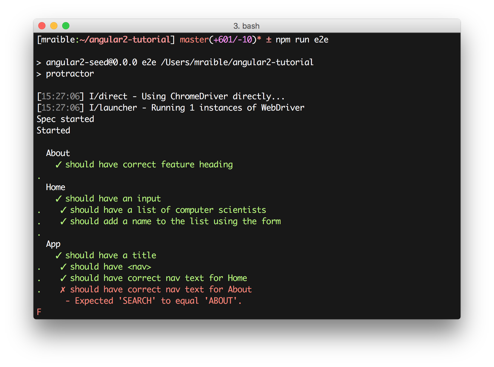
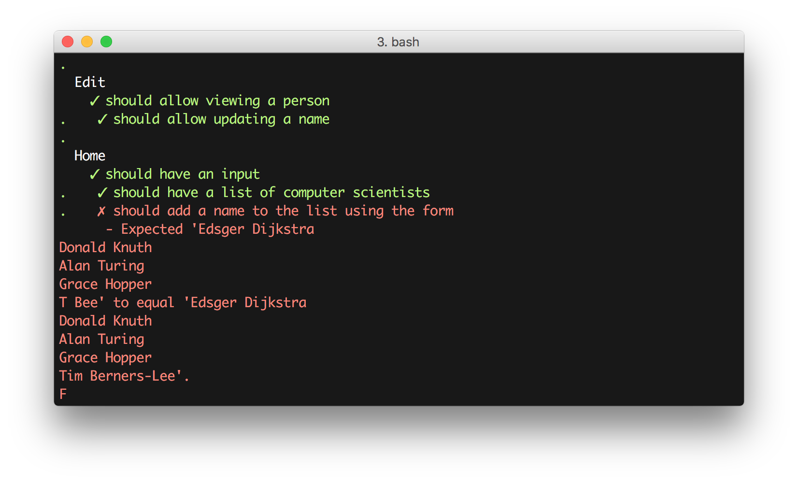
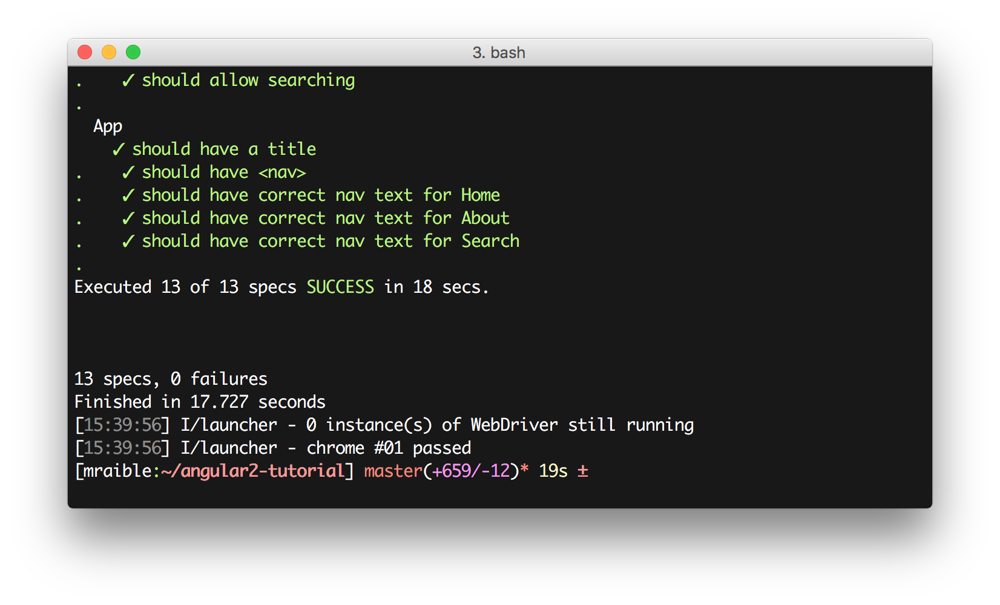
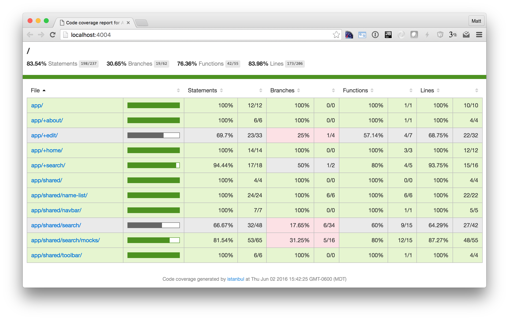

= Testing Angular 2 Applications

:author: Matt Raible
:email:  matt@raibledesigns.com
:revnumber: 1.1
:revdate:   {docdate}
:subject: Angular 2
:keywords: Angular 2, JavaScript, TypeScript, Jasmine, Karma, Protractor
:doctype: book
:toc: macro
:icons: font
:lang: en
:language: javadocript
:sourcedir: .

This article is the second in a series about learning Angular 2. It describes how to test a simple Angular 2 application.
In a previous article, Getting Started with Angular 2, I showed how to develop a simple search and edit feature.

toc::[]

== What you'll build

You'll learn to use http://jasmine.github.io/[Jasmine] for unit testing controllers and https://angular.github.io/protractor/[Protractor] for
integration testing. Angular's documentation has a good https://angular.io/docs/ts/latest/guide/testing.html[guide to unit testing] if you'd
like more information on testing and why it's important.

The best reason for writing tests is to automate your testing. Without tests, you'll likely be testing manually.
This manual testing will take longer and longer as your codebase grows.

== What you'll need

* About 15-30 minutes.
* A favorite text editor or IDE. I recommend https://www.jetbrains.com/idea/[IntelliJ IDEA].
* http://git-scm.com/[Git] installed.
* http://nodejs.org/[Node.js] and npm installed. I recommend using https://github.com/creationix/nvm[nvm].

== Get the tutorial project

Clone the https://github.com/mraible/angular2-tutorial[angular2-tutorial repository] using git, checkout the `testing-start` branch
and install its dependencies.

----
git clone https://github.com/mraible/angular2-tutorial.git
cd angular2-tutorial
git checkout testing-start
npm install
----

If you haven't completed the link:README.adoc[Getting Started with Angular 2] tutorial, you should peruse it so you understand how this application works.
You can also simply start the app with `npm start` and view it in your browser at http://localhost:5555/.

== Unit test the SearchService

Create `src/client/app/shared/search/search.service.spec.ts` and setup the test's infrastructure using https://angular.io/docs/js/latest/api/http/testing/MockBackend-class.html[MockBackend]
and https://angular.io/docs/js/latest/api/http/BaseRequestOptions-class.html[BaseRequestOptions].

[source,javascript]
.src/client/app/shared/search/search.service.spec.ts
----
import {
  beforeEachProviders,
  it,
  describe,
  expect,
  inject,
  fakeAsync,
  tick
} from '@angular/core/testing';
import { MockBackend } from '@angular/http/testing';
import { provide } from '@angular/core';
import { Http, ConnectionBackend, BaseRequestOptions, Response, ResponseOptions } from '@angular/http';
import { SearchService } from './search.service';

export function main() {
  describe('Search Service', () => {
    beforeEachProviders(() => {
      return [BaseRequestOptions, MockBackend, SearchService,
        provide(Http, {
          useFactory: (backend:ConnectionBackend, defaultOptions:BaseRequestOptions) => {
            return new Http(backend, defaultOptions);
          }, deps: [MockBackend, BaseRequestOptions]
        }),
      ];
    });
  });
}
----

If you run `npm test`, all tests will pass, but you don't see "Search Service" as a listed test. You can fix this by adding the first test of `getAll()`. This test shows how
`MockBackend` can be used to mock results and set the response.

TIP: When you are testing code that returns either a Promise or an RxJS Observable, you can use the `fakeAsync` helper to test that code as if it were synchronous.
Promises are be fulfilled and Observables are notified immediately after you call `tick()`.

The test below should be on the same level as `beforeEachProviders`.

[source,javascript]
.src/client/app/shared/search/search.service.spec.ts
----
it('should retrieve all search results',
  inject([SearchService, MockBackend], fakeAsync((searchService:SearchService, mockBackend:MockBackend) => {
    var res:Response;
    mockBackend.connections.subscribe(c => {
      expect(c.request.url).toBe('app/shared/search/data/people.json');
      let response = new ResponseOptions({body: '[{"name": "John Elway"}, {"name": "Gary Kubiak"}]'});
      c.mockRespond(new Response(response));
    });
    searchService.getAll().subscribe((response) => {
      res = response;
    });
    tick();
    expect(res[0].name).toBe('John Elway');
  }))
);
----

Running `npm test` should result in "12 tests completed". Add a couple more tests for filtering by search term and fetching by id.

[source,javascript]
.src/client/app/shared/search/search.service.spec.ts
----
it('should filter by search term',
  inject([SearchService, MockBackend], fakeAsync((searchService:SearchService, mockBackend:MockBackend) => {
    var res;
    mockBackend.connections.subscribe(c => {
      expect(c.request.url).toBe('app/shared/search/data/people.json');
      let response = new ResponseOptions({body: '[{"name": "John Elway"}, {"name": "Gary Kubiak"}]'});
      c.mockRespond(new Response(response));
    });
    searchService.search('john').subscribe((response) => {
      res = response;
    });
    tick();
    expect(res[0].name).toBe('John Elway');
  }))
);

it('should fetch by id',
  inject([SearchService, MockBackend], fakeAsync((searchService:SearchService, mockBackend:MockBackend) => {
    var res;
    mockBackend.connections.subscribe(c => {
      expect(c.request.url).toBe('app/shared/search/data/people.json');
      let response = new ResponseOptions({body: '[{"id": 1, "name": "John Elway"}, {"id": 2, "name": "Gary Kubiak"}]'});
      c.mockRespond(new Response(response));
    });
    searchService.search('2').subscribe((response) => {
      res = response;
    });
    tick();
    expect(res[0].name).toBe('Gary Kubiak');
  }))
);
----

If you want to have tests continually run as you add them, you can run the following commands in separate shell windows.

----
npm run build.test.watch
npm run karma.start
----

[TIP]
====
See https://www.jetbrains.com/help/idea/15.0/running-unit-tests-on-karma.html?origin=old_help[Running Unit Tests on Karma] to learn how to run your
tests from IntelliJ IDEA.
====

== Unit test the SearchComponent

To unit test the `SearchComponent`, create a `MockSearchProvider` that has http://angular-tips.com/blog/2014/03/introduction-to-unit-test-spies/[spies].
These allow you to _spy_ on functions to check if they were called.

Create `src/client/app/shared/search/mocks/search.service.ts` and populate it with spies for each method, as well as methods to set the response and subscribe to results.

[source,javascript]
.src/client/app/shared/search/mocks/search.service.ts
----
import { provide } from '@angular/core';
import { SpyObject } from './helper';

import { SearchService } from '../search.service';
import Spy = jasmine.Spy;

export class MockSearchService extends SpyObject {
  getAllSpy:Spy;
  getByIdSpy:Spy;
  searchSpy:Spy;
  saveSpy:Spy;
  fakeResponse:any;

  constructor() {
    super(SearchService);

    this.fakeResponse = null;
    this.getAllSpy = this.spy('getAll').andReturn(this);
    this.getByIdSpy = this.spy('get').andReturn(this);
    this.searchSpy = this.spy('search').andReturn(this);
    this.saveSpy = this.spy('save').andReturn(this);
  }

  subscribe(callback:any) {
    callback(this.fakeResponse);
  }

  setResponse(json:any):void {
    this.fakeResponse = json;
  }

  getProviders():Array<any> {
    return [provide(SearchService, {useValue: this})];
  }
}
----

In this same directory, create a `helper.ts` class to implement the `SpyObject` that `MockSearchService` extends.

[source,javascript]
.src/client/app/shared/search/mocks/helper.ts
----
import {StringMapWrapper} from '@angular/core/src/facade/collection';

export interface GuinessCompatibleSpy extends jasmine.Spy {
  /** By chaining the spy with and.returnValue, all calls to the function will return a specific
   * value. */
  andReturn(val: any): void;
  /** By chaining the spy with and.callFake, all calls to the spy will delegate to the supplied
   * function. */
  andCallFake(fn: Function): GuinessCompatibleSpy;
  /** removes all recorded calls */
  reset();
}

export class SpyObject {
  static stub(object = null, config = null, overrides = null) {
    if (!(object instanceof SpyObject)) {
      overrides = config;
      config = object;
      object = new SpyObject();
    }

    var m = StringMapWrapper.merge(config, overrides);
    StringMapWrapper.forEach(m, (value, key) => { object.spy(key).andReturn(value); });
    return object;
  }

  constructor(type = null) {
    if (type) {
      for (var prop in type.prototype) {
        var m = null;
        try {
          m = type.prototype[prop];
        } catch (e) {
          // As we are creating spys for abstract classes,
          // these classes might have getters that throw when they are accessed.
          // As we are only auto creating spys for methods, this
          // should not matter.
        }
        if (typeof m === 'function') {
          this.spy(prop);
        }
      }
    }
  }

  spy(name) {
    if (!this[name]) {
      this[name] = this._createGuinnessCompatibleSpy(name);
    }
    return this[name];
  }

  prop(name, value) { this[name] = value; }

  /** @internal */
  _createGuinnessCompatibleSpy(name): GuinessCompatibleSpy {
    var newSpy: GuinessCompatibleSpy = <any>jasmine.createSpy(name);
    newSpy.andCallFake = <any>newSpy.and.callFake;
    newSpy.andReturn = <any>newSpy.and.returnValue;
    newSpy.reset = <any>newSpy.calls.reset;
    // revisit return null here (previously needed for rtts_assert).
    newSpy.and.returnValue(null);
    return newSpy;
  }
}
----

Alongside, create `routes.ts` to mock Angular's `RouteSegment`.

[source,javascript]
.src/client/app/shared/search/mocks/routes.ts
----
import { RouteSegment } from '@angular/router';

export class MockRouteSegment implements RouteSegment {
  urlSegments:any;
  parameters:any;
  outlet:string;
  _type:any;
  _componentFactory:any;
  type:any;
  stringifiedUrlSegments:string;

  constructor(parameters?:{ [key:string]:any; }) {
    this.parameters = parameters;
  }

  getParam(param:string) {
    return this.parameters[param];
  }
}
----

With mocks in place, you can create a spec for `SearchComponent` that uses these as providers.

[source,javascript]
.src/client/app/+search/search.component.spec.ts
----
import { provide } from '@angular/core';
import { TestComponentBuilder } from '@angular/compiler/testing';
import {
  it,
  describe,
  expect,
  inject,
  beforeEachProviders,
} from '@angular/core/testing';

import { RouteSegment } from '@angular/router';
import { MockRouteSegment } from '../shared/search/mocks/routes';
import { MockSearchService } from '../shared/search/mocks/search.service';

import { SearchComponent } from './search.component';

export function main() {
  describe('Search component', () => {
    var mockSearchService:MockSearchService;

    beforeEachProviders(() => {
      mockSearchService = new MockSearchService();

      return [
        mockSearchService.getProviders(),
        provide(RouteSegment, { useValue: new MockRouteSegment({ 'term': 'peyton' }) })
      ];
    });
  });
}
----

Add two tests, one to verify a search term is used when it's set on the component and a second to verify search is called when a term is passed in as a route
parameter.

[source,javascript]
.src/client/app/+search/search.component.spec.ts
----
it('should search when a term is set and search() is called', inject([TestComponentBuilder], (tcb:TestComponentBuilder) => {
  return tcb.createAsync(SearchComponent).then((fixture) => {
    let searchComponent = fixture.debugElement.componentInstance;
    searchComponent.query = 'M';
    searchComponent.search();
    expect(mockSearchService.searchSpy).toHaveBeenCalledWith('M');
  });
}));

it('should search automatically when a term is on the URL', inject([TestComponentBuilder], (tcb:TestComponentBuilder) => {
  return tcb.createAsync(SearchComponent).then((fixture) => {
    fixture.detectChanges();
    expect(mockSearchService.searchSpy).toHaveBeenCalledWith('peyton');
  });
}));
----

Add a spec for the `EditComponent` as well, verifying fetching a single record works. Notice how you can access the component directly with
`fixture.debugElement.componentInstance`, or its rendered version with `fixture.debugElement.nativeElement`.

[source,javascript]
.src/client/app/+edit/edit.component.spec.ts
----
import { provide } from '@angular/core';
import { TestComponentBuilder } from '@angular/compiler/testing';
import {
  it,
  describe,
  expect,
  inject,
  beforeEachProviders,
} from '@angular/core/testing';

import { RouteSegment } from '@angular/router';
import { ROUTER_FAKE_PROVIDERS } from '@angular/router/testing';
import { MockRouteSegment } from '../shared/search/mocks/routes';
import { MockSearchService } from '../shared/search/mocks/search.service';

import { EditComponent } from './edit.component';

export function main() {
  describe('Edit component', () => {
    var mockSearchService:MockSearchService;

    beforeEachProviders(() => {
      mockSearchService = new MockSearchService();

      return [
        mockSearchService.getProviders(),
        ROUTER_FAKE_PROVIDERS,
        provide(RouteSegment, { useValue: new MockRouteSegment({ 'id': '1' }) })
      ];
    });

    it('should fetch a single record', inject([TestComponentBuilder], (tcb:TestComponentBuilder) => {
      return tcb.createAsync(EditComponent).then((fixture) => {
        let person = {name: 'Emmanuel Sanders', address: {city: 'Denver'}};
        mockSearchService.setResponse(person);

        fixture.detectChanges();
        // verify service was called
        expect(mockSearchService.getByIdSpy).toHaveBeenCalledWith(1);

        // verify data was set on component when initialized
        let editComponent = fixture.debugElement.componentInstance;
        expect(editComponent.editAddress.city).toBe('Denver');

        // verify HTML renders as expected
        var compiled = fixture.debugElement.nativeElement;
        expect(compiled.querySelector('h3')).toHaveText('Emmanuel Sanders');
      });
    }));
  });
}
----

You should see "[green]#✔ 22 tests completed#" in the shell window that's running `npm run karma.start`. If you don't, try cancelling the command and restarting.

== Integration test the search UI

To test if the application works end-to-end, you can write tests with http://angular.github.io/protractor[Protractor]. These are also known as integration tests,
since they test the _integration_ between all layers of your application.

To verify end-to-end tests work in the project before you begin, run the following commands in three different console windows.

----
# npm run webdriver-update <- You will need to run this the first time
npm run webdriver-start
npm run serve.e2e
npm run e2e
----

You should receive an error stating that the "nav text for About" is incorrect.

[[protractor-nav-error]]
.Protractor nav test error

This happens because we added a Search link to the navbar and didn't update the test that looks for the last child.

[source,javascript]
.src/client/app/app.component.e2e-spec.ts
----
it('should have correct nav text for About', () => {
    expect(element(by.css('sd-app sd-navbar nav a:last-child')).getText()).toEqual('ABOUT');
});
----

Replace this test with the one below, and add a new one to verify the Search link is last.

[source,javascript]
.src/client/app/app.component.e2e-spec.ts
----
it('should have correct nav text for About', () => {
  expect(element(by.css('sd-app sd-navbar nav a:nth-child(2)')).getText()).toEqual('ABOUT');
});

it('should have correct nav text for Search', () => {
  expect(element(by.css('sd-app sd-navbar nav a:last-child')).getText()).toEqual('SEARCH');
});
----

Now when you run `npm run e2e`, all specs should pass.

=== Testing the search feature

Create a new `search.component.e2e-spec.ts` spec in the same directory as your `SearchComponent`. Add tests to verify elements are rendered correctly and
search works. At the time of this writing, Protractor's `by.model` and `by.repeater` don't work with Angular 2. For this reason, I used `by.css` to
verify the HTML renders as expected.

[source,javascript]
.src/client/app/+search/search.component.e2e-spec.ts
----
describe('Search', () => {

  beforeEach(() => {
    browser.get('/search');
  });

  it('should have an input and search button', () => {
    expect(element(by.css('sd-app sd-search form input')).isPresent()).toEqual(true);
    expect(element(by.css('sd-app sd-search form button')).isPresent()).toEqual(true);
  });

  it('should allow searching', () => {
    let searchButton = element(by.css('button'));
    let searchBox = element(by.css('input'));
    searchBox.sendKeys('M');
    searchButton.click().then(() => {
      // doesn't work as expected - results in 0
      //expect(element.all(by.repeater('person of searchResults')).count()).toEqual(3);
      var list = element.all(by.css('sd-search table tbody tr'));
      expect(list.count()).toBe(3);
    });
  });
});
----

=== Testing the edit feature

Create an `edit.component.e2e-spec.ts` spec to verify the `EditComponent` renders a person's information and that you can update their information.

[source,javascript]
.src/client/app/+edit/edit.component.e2e-spec.ts
----
describe('Edit', () => {

  beforeEach(() => {
    browser.get('/edit/1');
  });

  let name = element(by.id('name'));
  let street = element(by.id('street'));
  let city = element(by.id('city'));

  it('should allow viewing a person', () => {
    expect(element(by.css('h3')).getText()).toEqual('Peyton Manning');
    expect(name.getAttribute('value')).toEqual('Peyton Manning');
    expect(street.getAttribute('value')).toEqual('1234 Main Street');
    expect(city.getAttribute('value')).toEqual('Greenwood Village');
  });

  it('should allow updating a name', function () {
    let save = element(by.id('save'));
    // send individual characters since sendKeys passes partial values sometimes
    // https://github.com/angular/protractor/issues/698
    ' Won!'.split('').forEach((c) => name.sendKeys(c));
    save.click();
    // verify one element matched this change
    var list = element.all(by.css('sd-search table tbody tr'));
    expect(list.count()).toBe(1);
  });
});
----

Run `npm run e2e` to verify all your end-to-end tests pass. You might receive a failure for the "Home" test.

[[protractor-home-error]]
.Protractor Home error

If you do, open `src/client/app/+home/home.component.e2e-spec.ts` and change line 17 from this:

[source,javascript]
.src/client/app/+home/home.component.e2e-spec.ts
----
element(by.css('sd-home form input')).sendKeys('Tim Berners-Lee');
----

To this:

[source,javascript]
.src/client/app/+home/home.component.e2e-spec.ts
----
let input = element(by.css('sd-home form input'));
'Tim Berners-Lee'.split('').forEach((c) => input.sendKeys(c));
----

Run `npm run e2e` again. You should see a success message similar to the one below in your terminal window.

[[protractor-success]]
.Protractor success

If you made it this far and have all 13 specs passing - congratulations!
You're well on your way to writing quality code with Angular 2 and verifying it works.

== Source code

A completed project with this code is available on GitHub at https://github.com/mraible/angular2-tutorial.

== Continuous Integration

The angular2-seed project ships with a `.travis.yml` that you can use to run continuous integration for this application
through https://travis-ci.org/[Travis CI]. To enable builds on Travis CI, login and enable builds for the
GitHub repo you created the project in. Then trigger your first build with a `git push`.

When I first tried this, I received a https://travis-ci.org/mraible/angular2-tutorial/jobs/135517549#L1189[failure] because
Protractor on Travis CI is https://github.com/mgechev/angular2-seed/issues/970[unable to navigate directly]
to the search and edit components. I was able to workaround this by modifying `search.component.e2e-spec.ts` to start
at the top and navigate to the component.

[source,javascript]
.src/client/app/+search/search.component.e2e-spec.ts
----
beforeEach(() => {
  browser.get('/');
  element(by.linkText('SEARCH')).click();
});
----

I did something similar with `edit.component.e2e-spec.ts`:

[source,javascript]
.src/client/app/+edit/edit.component.e2e-spec.ts
----
beforeEach(() => {
  browser.get('/');
  element(by.linkText('SEARCH')).click();
  let search = element(by.css('sd-search form input'));
  'Man'.split('').forEach((c) => search.sendKeys(c));
  element(by.css('sd-search form button')).click();
  element(by.linkText('Peyton Manning')).click();
});
----

After making these changes, https://travis-ci.org/mraible/angular2-tutorial/builds/135598015[all e2e tests passed in Travis CI].

== Summary

I hope you've enjoyed this quick-and-easy tutorial on testing Angular 2 applications. You can see the test coverage of your project by running
`npm run serve.coverage`. You'll notice that the new components and service could use some additional coverage. I'll leave that as a task
for the reader. Please send a pull request if you're feeling ambitious.

[[test-coverage]]
.Test coverage

I learned a lot about testing from https://www.ng-book.com/2/[ng-book 2] and its Testing chapter. If you have any Angular 2
testing tips and tricks you'd like to share, I'd love to hear about them.

